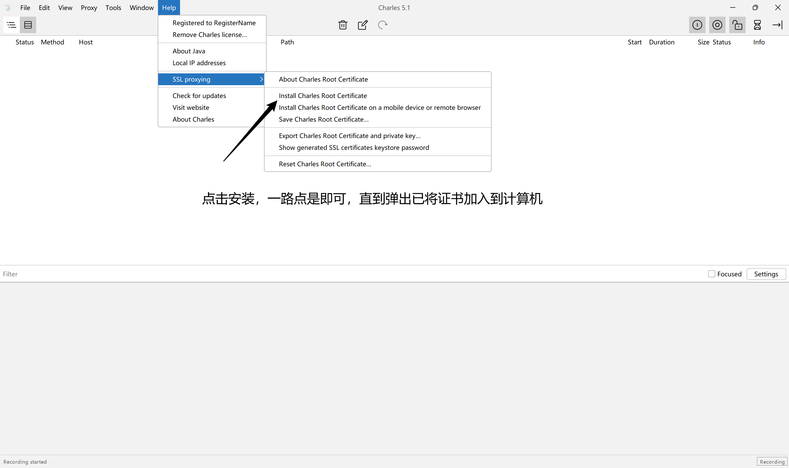
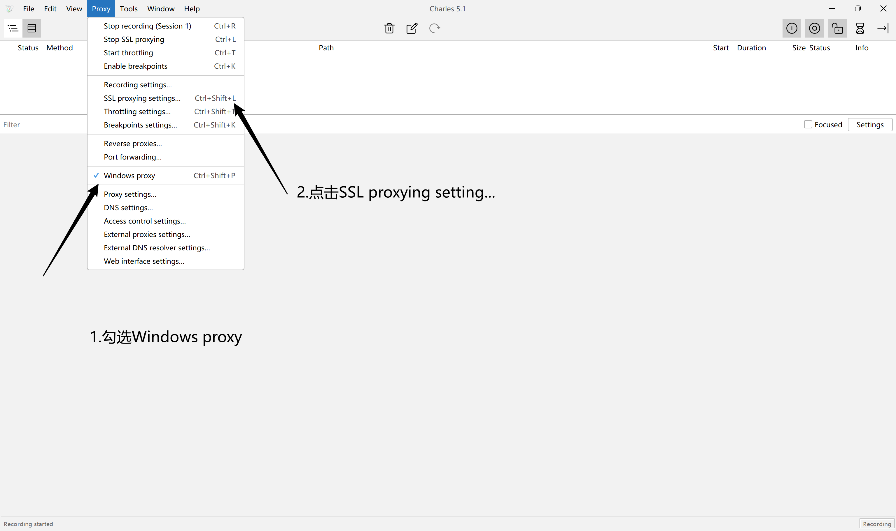
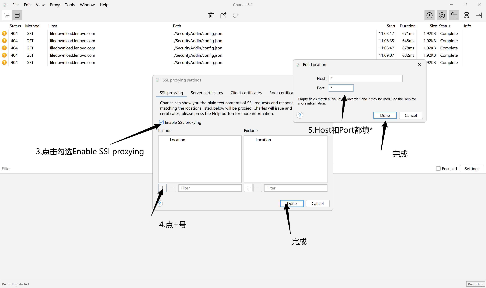
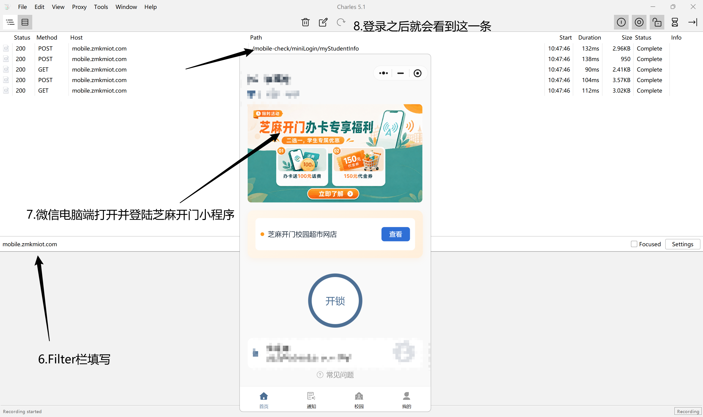
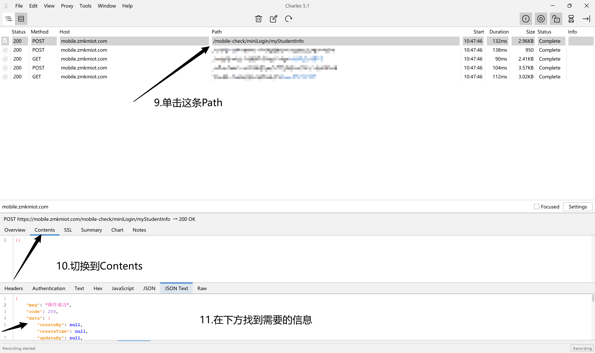

# HIST_Unlocker

## 抓包获取参数

1. 
2. 
3. 
4. 
5. 

## Python 版

```bash
pip install pycryptodome bleak
```

填写 `config.json`（模板见 `config.example.json`）：

| 字段 | 说明 |
| --- | --- |
| lockMac | 门锁蓝牙 MAC |
| aesKey | 16 字节密钥 |
| authCode | 鉴权码（hex） |
| keyGroupId | 密钥组 ID |
| timezoneOffset | 时区偏移（分钟） |

```bash
python hist_unlocker.py
```

## Android 版

`HistUnlocker.kt` 顶部 `companion object` 中填入 `LOCK_MAC`、`AES_KEY`、`AUTH_CODE`、`KEY_GROUP_ID`，授权后点「一键开锁」。

源码位于 `apk/`，`./gradlew assembleDebug` 构建。
